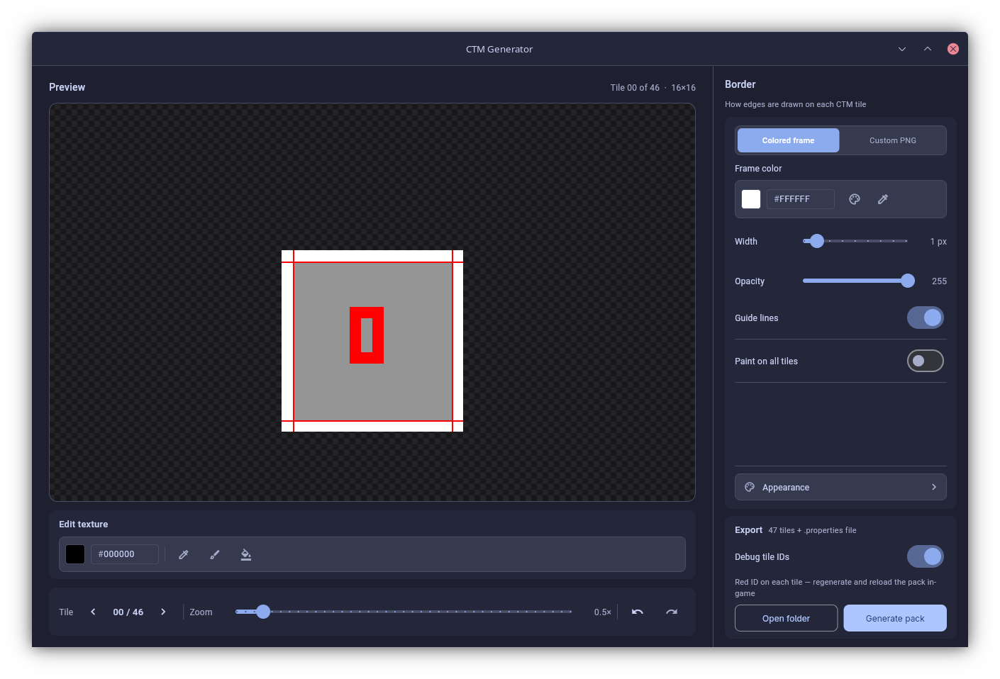

# CTM Generator

Desktop tool for making OptiFine connected texture packs from a single block PNG. You load the texture, set up borders, preview the layout, and export tiles `0.png`–`46.png` plus the `.properties` file.

Python + [Flet](https://flet.dev) + Pillow. Everything lives in `main.py`.



## Guide video

<video src="assets/guide.web.mp4" controls width="720"></video>

## What it does

- Slices one source image into all 47 standard CTM tiles
- Live preview with zoom
- Colored frame borders (width, alpha, color, eyedropper) or a custom frame PNG
- Basic paint tools on the loaded texture: pick, brush, fill, undo/redo
- Red guide lines for where borders get cut
- **Debug tile IDs**: stamps each tile with its index in red so you can see what OptiFine picks in-game, then regenerate without debug when you're done
- A handful of UI themes (Moonlight is the default; also Light, Dark, Obsidian, Catppuccin, Dracula, Nord)

## Install

```bash
git clone https://github.com/oNxZero/CTM-Gen.git
cd CTM-Gen
pip install -r requirements.txt
python main.py
```

Linux and Windows. Use `python` or `python3` depending on what your system has.

## Quick start

1. **Open texture**: your base block PNG.
2. Pick a border mode:
   - **Colored frame**: procedural border. Eyedropper samples from the preview.
   - **Custom PNG**: separate image with just the frame (transparent center).
3. Zoom, toggle guide lines, paint if something needs a touch-up.
4. **Generate pack**: choose a folder. The app writes a subfolder with all tiles and the properties file.
5. Copy the output into your resource pack:

```
assets/minecraft/optifine/ctm/<your_texture_name>/
```

If CTM looks wrong in-game, turn on **Debug tile IDs** in the Export panel, place blocks, note which numbers show up on bad faces, fix the source, turn debug off, and export again.

## Settings

Theme and last save folder are stored in `~/.config/ctm-generator/settings.json`.

Moonlight palette is from [oNxZero/Moonlight](https://github.com/oNxZero/Moonlight).

## Credits

Tile indexing idea from [Minecraft-Connected-Textures-Generator-CTM](https://github.com/Rostezkiy/Minecraft-Connected-Textures-Generator-CTM) by Rostezkiy. This repo is a rewrite with a new UI, preview, paint tools, and export flow.

## License

MIT
